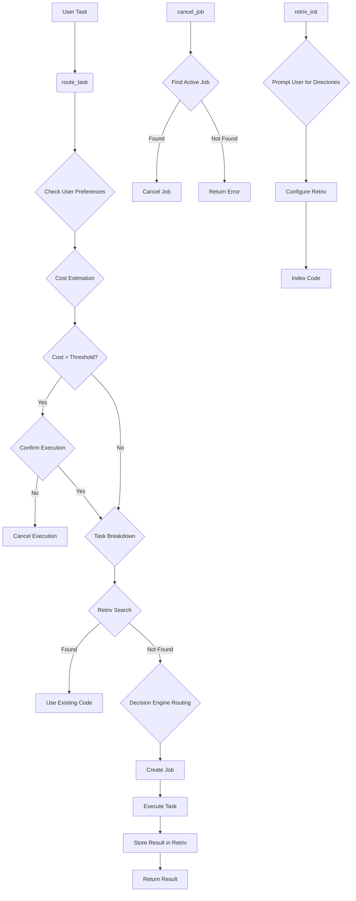
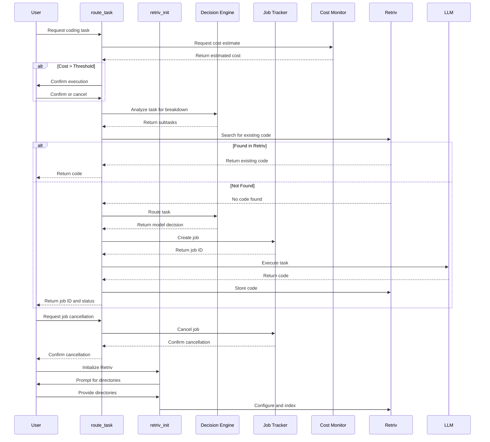
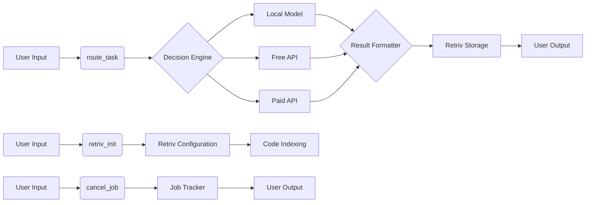

# Revised Route Task Refactor Plan

## I. Overall Architecture

The refactored tools will follow a microservices architecture, with each tool responsible for a specific task. The decision engine will act as the orchestrator, breaking down complex tasks into smaller jobs and routing them to the appropriate tools.



## II. Tool Refactoring

1. **route_task:**
   * Modify the `route_task` tool to initiate a structured workflow.
   * **Step 1: Load User Preferences:** The `route_task` tool should load stored user preferences from a configuration file.
   * **Step 2: Cost Estimation:** Before routing the task, `route_task` must query the `get_cost_estimate` API to assess execution costs. If the estimated cost exceeds a predefined threshold, prompt the user to confirm or cancel execution before proceeding.
   * **Step 3: Task Breakdown Analysis:** The `route_task` tool must query the Decision Engine to determine if task segmentation is necessary.
   * **Step 4: Retriv Search:** If no segmentation is needed, the system checks Retriv for existing code solutions before generating anything new.
   * **Step 5: Decision Engine Routing:** If no suitable code is found, the decision engine will determine the most cost-efficient way to execute the task, considering task complexity and benchmarking data.
   * **Step 6: Job Creation:** A new job will be created and logged in `locallama://jobs/active`.
   * **Step 7: Progress Tracking:** The tool will use `locallama://jobs/progress/{jobId}` to track the progress of the job.
   * **Step 8: Code Output:** The tool will enforce a standardized return format (DIFF or new file) and store the result in Retriv.
   * **Step 9: Task Cancellation Support:** Users must be able to cancel an active job. If a job is running too long or is unnecessary, they should have a cancel option available.

2. **retriv_init:**
   * Create a new tool for initializing and configuring Retriv.
   * Allow users to specify which directories to include/exclude from indexing.
   * Provide configuration options for Retriv's behavior.
   * This tool should be separate from `route_task` and run independently.

3. **cancel_job:**
   * Implement a new endpoint for canceling a running job.
   * Leverage the existing `cancelJob` method in the job tracker.
   * Provide clear feedback on the cancellation status.

4. **get_cost_estimate:**
   * No changes required.

5. **get_active_jobs:**
   * No changes required.

6. **get_job_progress/{jobId}:**
   * No changes required.

7. **get_free_models:**
   * No changes required.

8. **benchmark_task:**
   * No changes required.

## III. Decision Engine Enhancements

1. **Retriv Integration:**
   * Implement a "Retriv First" strategy to prioritize existing code.
   * Integrate with the existing Retriv implementation to search for and retrieve code solutions.

2. **Task Breakdown:**
   * Leverage existing decision engine capabilities for task segmentation.
   * No new implementation required as this functionality already exists.

3. **Multi-Model Routing:**
   * Ensure that the cheapest viable option (local → free API → paid API) is used.
   * This functionality is already implemented in the decision engine.

4. **Job Tracking:**
   * Log all assigned jobs with real-time progress tracking.
   * Integrate with the existing job tracker implementation.

5. **Token & Cost Optimization:**
   * Predict costs and prevent runaway API usage.
   * This functionality is already implemented in the cost monitor.

## IV. User Interaction

Instead of relying on VSCode-specific APIs, we'll implement user interaction through the MCP server's response mechanism:

1. **User Preferences:**
   * Store user preferences in a configuration file.
   * Provide a simple interface for updating preferences.

2. **Cost Confirmation:**
   * If the estimated cost exceeds a predefined threshold, return a response that requires user confirmation before proceeding.

3. **Task Progress Display:**
   * Use `locallama://jobs/progress/{jobId}` to provide progress updates through the MCP server's response mechanism.

4. **Job Queue Visibility:**
   * Provide a resource endpoint for viewing active jobs.

5. **Code Diff Preview:**
   * Return DIFFs in a standardized format that can be easily displayed.

6. **Task Cancellation:**
   * Provide a simple interface for canceling active jobs.

## V. LLM Compatibility

1. **Context Limitations:**
   * Use Retriv pre-filtering to reduce the context size.

2. **Model-Specific Quirks:**
   * Enforce modularized DIFF generation to ensure proper function boundaries.

3. **Latency Considerations:**
   * Factor in speed vs. cost preferences when routing tasks.

4. **Prompt Optimization:**
   * Use concise but informative prompts in routing tasks.

## VI. Implementation Steps

1. **Implement the `cancel_job` endpoint:**
   * This is critical for preventing runaway costs and should be prioritized.
   * Leverage the existing `cancelJob` method in the job tracker.

2. **Create the `retriv_init` tool:**
   * Implement a separate tool for initializing and configuring Retriv.
   * Allow users to specify which directories to include/exclude from indexing.

3. **Modify the `route_task` tool:**
   * Integrate with existing components rather than implementing new features.
   * Implement the "Retriv First" strategy to prioritize existing code.

4. **Implement user interaction mechanisms:**
   * Create configuration file for user preferences.
   * Implement response mechanisms for cost confirmation, progress updates, and job cancellation.

5. **Test the refactored tools:**
   * Ensure compatibility with different LLMs.
   * Verify that the "Retriv First" strategy works correctly.
   * Test the job cancellation functionality.

## VII. Code Examples

### Example of a new `route_task` implementation:

```typescript
// src/modules/api-integration/tools.ts
case 'route_task': {
  try {
    // Step 1: Load User Preferences
    const userPreferences = await loadUserPreferences();
    const executionMode = userPreferences.executionMode || 'Fully automated selection';

    // Step 2: Cost Estimation
    const costEstimate = await costMonitor.estimateCost({
      contextLength: (args.context_length as number) || 0,
      outputLength: (args.expected_output_length as number) || 0,
      complexity: (args.complexity as number) || 0.5,
    });

    const costThreshold = config.costThreshold || 0.5; // Example threshold
    if (costEstimate.openrouter_paid > costThreshold && executionMode !== 'Local model only') {
      // Return a response that requires user confirmation
      return {
        content: [
          {
            type: 'text',
            text: JSON.stringify({
              type: 'cost_confirmation',
              estimated_cost: costEstimate.openrouter_paid,
              message: 'Estimated cost exceeds threshold. Do you want to continue?',
              options: ['Yes', 'No']
            }, null, 2),
          },
        ],
      };
    }

    // Step 3: Task Breakdown Analysis
    let subtasks: any[] = [];
    if (executionMode !== 'Local model only'){
        subtasks = await decisionEngine.analyzeCodeTask(args.task);
    }

    // Step 4: Retriv Search
    let retrivResults: any[] = [];
    if (subtasks.length === 0){
        const codeSearchEngine = await getCodeSearchEngine();
        retrivResults = await codeSearchEngine.search(args.task);
    }

    if (retrivResults.length > 0) {
      // Use existing code
      return {
        content: [{ type: 'text', text: JSON.stringify(retrivResults[0], null, 2) }],
      };
    } else {
      // Step 5: Decision Engine Routing
      const decision = await decisionEngine.routeTask({
        task: args.task as string,
        contextLength: (args.context_length as number) || 0,
        expectedOutputLength: (args.expected_output_length as number) || 0,
        complexity: (args.complexity as number) || 0.5,
        priority: (args.priority as 'speed' | 'cost' | 'quality') || 'quality',
      });

      // Step 6: Job Creation
      const jobId = uuidv4();
      jobTracker.createJob(jobId, args.task, decision.model);

      // Step 7: Progress Tracking
      jobTracker.updateJobProgress(jobId, 0);

      // Step 8: Code Output (implementation details omitted for brevity)
      const result = await executeTask(decision.model, args.task);
      const formattedResult = formatResult(result);

      // Store result in Retriv (implementation details omitted for brevity)
      const codeSearchEngine = await getCodeSearchEngine();
      await codeSearchEngine.indexDocuments([{ content: formattedResult, path: `job_${jobId}`, language: 'typescript' }]);

      // Step 9: Task Cancellation Support
      jobTracker.completeJob(jobId);

      return {
        content: [
          {
            type: 'text',
            text: JSON.stringify({ jobId, status: 'Completed', result: formattedResult }, null, 2),
          },
        ],
      };
    }
  } catch (error: any) {
    logger.error('Error routing task:', error);
    return {
      content: [
        {
          type: 'text',
          text: `Error routing task: ${error instanceof Error ? error.message : String(error)}`,
        },
      ],
      isError: true,
    };
  }
}
```

### Example of a new `retriv_init` implementation:

```typescript
// src/modules/api-integration/tools.ts
case 'retriv_init': {
  try {
    // Validate arguments
    if (!args.directories || !Array.isArray(args.directories)) {
      return {
        content: [{ type: 'text', text: 'Missing or invalid required argument: directories' }],
        isError: true,
      };
    }

    // Initialize the code search engine
    const codeSearchEngine = new CodeSearchEngine(process.cwd(), {
      excludePatterns: args.exclude_patterns as string[] || undefined,
      chunkSize: args.chunk_size as number || undefined,
      bm25Options: args.bm25_options as BM25Options || undefined,
    });

    // Initialize the engine
    await codeSearchEngine.initialize();

    // Index the specified directories
    for (const directory of args.directories as string[]) {
      await codeSearchEngine.indexWorkspace(directory, args.force_reindex as boolean || false);
    }

    return {
      content: [
        {
          type: 'text',
          text: JSON.stringify({
            message: 'Retriv initialized and indexed successfully',
            indexed_directories: args.directories,
            document_count: codeSearchEngine.getDocumentCount(),
          }, null, 2),
        },
      ],
    };
  } catch (error: any) {
    logger.error('Error initializing Retriv:', error);
    return {
      content: [
        {
          type: 'text',
          text: `Error initializing Retriv: ${error instanceof Error ? error.message : String(error)}`,
        },
      ],
      isError: true,
    };
  }
}
```

### Example of a new `cancel_job` implementation:

```typescript
// src/modules/api-integration/tools.ts
case 'cancel_job': {
  try {
    // Validate arguments
    if (!args.job_id) {
      return {
        content: [{ type: 'text', text: 'Missing required argument: job_id' }],
        isError: true,
      };
    }

    // Get the job
    const job = jobTracker.getJob(args.job_id as string);
    if (!job) {
      return {
        content: [{ type: 'text', text: `Job with ID ${args.job_id} not found` }],
        isError: true,
      };
    }

    // Check if the job can be cancelled
    if (job.status === 'Completed' || job.status === 'Cancelled' || job.status === 'Failed') {
      return {
        content: [{ type: 'text', text: `Job with ID ${args.job_id} is already ${job.status.toLowerCase()}` }],
        isError: true,
      };
    }

    // Cancel the job
    jobTracker.cancelJob(args.job_id as string);

    return {
      content: [
        {
          type: 'text',
          text: JSON.stringify({
            message: `Job with ID ${args.job_id} has been cancelled`,
            job: jobTracker.getJob(args.job_id as string),
          }, null, 2),
        },
      ],
    };
  } catch (error: any) {
    logger.error('Error cancelling job:', error);
    return {
      content: [
        {
          type: 'text',
          text: `Error cancelling job: ${error instanceof Error ? error.message : String(error)}`,
        },
      ],
      isError: true,
    };
  }
}
```

## VIII. Mermaid Diagrams

### Component Interactions



### Data Flow



## IX. Performance and Compatibility Considerations

1. **Python Dependency for Retriv:**
   * The Retriv implementation relies on a Python bridge, which adds a dependency and potential point of failure.
   * Ensure proper error handling for cases where the Python process fails to start or crashes.
   * Consider adding a health check mechanism for the Python bridge.

2. **Synchronous Processing:**
   * The current implementation appears to process tasks synchronously, which could lead to blocking behavior for long-running tasks.
   * Consider implementing an asynchronous processing mechanism for long-running tasks.
   * Use the job tracking system to provide progress updates.

3. **Error Handling:**
   * Improve error handling in the job tracker and decision engine to better handle failures in subtasks.
   * Implement proper error propagation and recovery mechanisms.
   * Ensure that errors are properly logged and reported to the user.

4. **Memory Usage:**
   * Storing large code repositories in Retriv could lead to high memory usage.
   * Implement chunking and pagination for large code repositories.
   * Consider adding configuration options for limiting the size of indexed code.

5. **Model Context Window Limitations:**
   * Different LLMs have different context window sizes, which might affect how tasks are broken down.
   * Ensure that the task breakdown system takes into account the context window size of the selected model.
   * Implement fallback mechanisms for cases where a task is too large for the selected model.