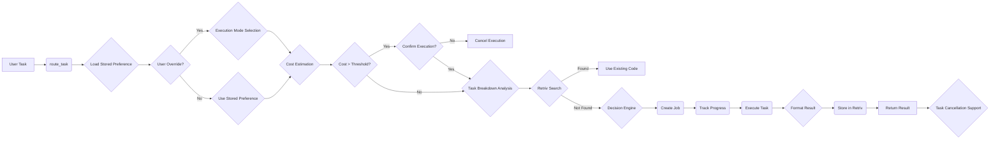

# VIII. Mermaid Diagrams



```mermaid
sequenceDiagram
    participant User
    participant VS Code
    participant route_task
    participant get_cost_estimate
    participant Decision Engine
    participant Retriv
    participant Job Tracker
    participant LLM

    User->>VS Code: Request coding task
    VS Code->>route_task: Call route_task tool
    route_task->>VS Code: Load stored preference
    VS Code->>User: Use saved preference or override?
    User->>VS Code: Select mode
    VS Code->>route_task: Return execution mode
    route_task->>get_cost_estimate: Request cost estimate
    get_cost_estimate-->>route_task: Return estimated cost
    alt Cost > Threshold
        route_task->>VS Code: Notify user of high cost
        VS Code->>User: Confirm or cancel execution
        User->>VS Code: Cancel execution
        VS Code->>route_task: Cancel execution
        route_task-->>VS Code: Return cancellation message
        VS Code->>User: Display cancellation message
    else Cost <= Threshold
        route_task->>Decision Engine: Analyze task for breakdown
        Decision Engine-->>route_task: Return subtasks (if any)
        route_task->>Retriv: Search for relevant code
        alt Found
            Retriv-->>route_task: Return existing code
            route_task-->>VS Code: Return code
            VS Code->>User: Display code
        else Not Found
            Retriv-->>route_task: No code found
            route_task->>Decision Engine: Route task
            Decision Engine-->>route_task: Return model decision
            route_task->>Job Tracker: Create job
            Job Tracker-->>route_task: Return job ID
            route_task->>LLM: Execute task
            LLM-->>route_task: Return code
            route_task->>Retriv: Store code
            route_task-->>VS Code: Return job ID and status
            VS Code->>User: Display job status
        end
    end
    User->>VS Code: Request job cancellation
    VS Code->>route_task: Request job cancellation
    route_task->>Job Tracker: Cancel job
    Job Tracker-->>route_task: Confirm job cancellation
    route_task-->>VS Code: Confirm job cancellation
    VS Code->>User: Display job cancellation