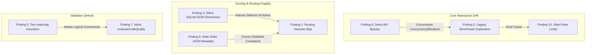

# Technical Triage and Architecture Governance Report

This report evaluates and triages the findings from the repository audit against the project’s defined direction (established in [AGENTS.md](file:///C:/Users/herat/source/locallama-mcp/docs/AGENTS.md) and [PLAN.md](file:///C:/Users/herat/source/locallama-mcp/docs/PLAN.md)). It groups and deduplicates symptoms, classifies them by severity and type, maps them to architectural violations, and details appropriate governance actions (GitHub Issues, PRD updates, or test improvements).

---

## 1. Triage Summary & Deduplication Map

Several findings are symptoms of the same underlying root cause. The following diagram shows how these findings map to each other:

---

## 2. Detailed Findings Triage

### Finding 1: Routing Heuristic Bias (Small Models Win by Default)
*   **Severity**: High
*   **Root Cause**: Imbalance in scoring weights in [modelSelector.ts](file:///C:/Users/herat/source/locallama-mcp/src/modules/decision-engine/services/modelSelector.ts#L44-L150). Telemetry-based scoring yields values up to `1.1`, while fallback/unbenchmarked heuristics cap at `0.4`. Fast, small models (e.g. 2B/3B) running quick tests permanently outscore larger models (e.g. 70B) that lack initial run records.
*   **Affected Subsystem**: `decision-engine` (Model Selector)
*   **Action Required**: Yes
*   **Recommended Action Type**: Bug / Architectural
*   **Implementation Priority**: High
*   **Governance Categorization**: **GitHub Issue**. This violates the core PRD goal of capability-first routing.
*   **Scope**: Architectural (influences routing system behavior globally)

### Finding 2: Legacy Benchmarking Duplication
*   **Severity**: Medium
*   **Root Cause**: Coexistence of a legacy, monolithic class ([benchmarkService.ts](file:///C:/Users/herat/source/locallama-mcp/src/modules/decision-engine/services/benchmarkService.ts#L565-L700)) and the newer modular engine in `src/modules/benchmark/`. Legacies like `benchmark_free_models` are routed through the old code path, bypassing the clean modular provider design.
*   **Affected Subsystem**: `decision-engine` / `benchmark`
*   **Action Required**: Yes
*   **Recommended Action Type**: Architectural Drift / Technical Debt
*   **Implementation Priority**: Medium
*   **Governance Categorization**: **GitHub Issue**. This directly violates the "provider-neutral LLM layer" priority.
*   **Scope**: Architectural (violates clean module boundary goals)

### Finding 3: SQLite vs. JSON Persistence Disconnect
*   **Severity**: High
*   **Root Cause**: The modular benchmarker writes results to SQLite (`benchmarks.db`) and calls `ModelRegistry.updateBenchmarkSummary`. However, [modelSelector.ts](file:///C:/Users/herat/source/locallama-mcp/src/modules/decision-engine/services/modelSelector.ts#L50) reads exclusively from `modelsDbService` which points to `models-db.json`. There is no synchronization pathway from modular benchmaker writes back to the JSON store.
*   **Affected Subsystem**: `benchmark` / `decision-engine` (Persistence)
*   **Action Required**: Yes
*   **Recommended Action Type**: Bug / Architectural
*   **Implementation Priority**: Critical
*   **Governance Categorization**: **GitHub Issue**. Telemetry is successfully collected but completely ignored by routing.
*   **Scope**: Architectural (unaligned data sources)

### Finding 4: Complexity Down-Routing (Complexity Capping)
*   **Severity**: Medium
*   **Root Cause**: Forced capping of subtask complexity to 0.8 in [codeTaskCoordinator.ts](file:///C:/Users/herat/source/locallama-mcp/src/modules/decision-engine/services/codeTaskCoordinator.ts#L195-L215) to artificially guarantee that a model can be selected.
*   **Affected Subsystem**: `decision-engine` (Task Coordinator)
*   **Action Required**: Yes
*   **Recommended Action Type**: Operational Risk / Architectural
*   **Implementation Priority**: Medium
*   **Governance Categorization**: **PRD Update & Architecture Documentation**. Capping complexity is an escape-hatch strategy. Instead of pretending a task is easy, the system should document fallback behavior when paid routing is unavailable.
*   **Scope**: Architectural (alters routing semantics)

### Finding 5: Crude Text-Matching Verification Heuristics
*   **Severity**: Medium
*   **Root Cause**: [quality.ts](file:///C:/Users/herat/source/locallama-mcp/src/modules/benchmark/evaluation/quality.ts#L197-L264) measures code accuracy by counting grammar particles (`is`, `was`, `are`) and simply matching brackets, returning a high success/quality score to invalid code.
*   **Affected Subsystem**: `benchmark` (Evaluation)
*   **Action Required**: Yes
*   **Recommended Action Type**: Technical Debt / Missing Validation
*   **Implementation Priority**: Low
*   **Governance Categorization**: **Test Coverage Improvements / Future Roadmap**. Real executable validation (syntax compilers/interpreters) should be added to the roadmap, while heuristics are designated as secondary metadata.
*   **Scope**: Localized (evaluation implementation)

### Finding 6: Registry Bypass in Code Evaluation
*   **Severity**: Medium
*   **Root Cause**: Direct import and invocation of `openRouterModule.callOpenRouterApi(...)` inside [codeEvaluationService.ts](file:///C:/Users/herat/source/locallama-mcp/src/modules/decision-engine/services/codeEvaluationService.ts#L279), circumventing concurrency wrappers and circuit breakers.
*   **Affected Subsystem**: `decision-engine` / `api-integration`
*   **Action Required**: Yes
*   **Recommended Action Type**: Architectural Drift / Technical Debt
*   **Implementation Priority**: High
*   **Governance Categorization**: **GitHub Issue**. Breaks central provider orchestration.
*   **Scope**: Architectural (bypasses concurrency controls)

### Finding 7: Coordinator `evaluateCodeQuality` Misnomer
*   **Severity**: Low
*   **Root Cause**: [codeTaskCoordinator.ts](file:///C:/Users/herat/source/locallama-mcp/src/modules/decision-engine/services/codeTaskCoordinator.ts#L81-L98) implements a function named `evaluateCodeQuality` that only checks subtask definition metadata, not actual code.
*   **Affected Subsystem**: `decision-engine` (Task Coordinator)
*   **Action Required**: Yes
*   **Recommended Action Type**: Technical Debt
*   **Implementation Priority**: Low
*   **Governance Categorization**: **Refactor / Cleanup**. The function should be renamed to match its actual purpose (e.g. `validateTaskStructure`).
*   **Scope**: Localized (naming/refactoring task)

### Finding 8: Missing Intra-Provider VRAM Release Hooks
*   **Severity**: High
*   **Root Cause**: The provider registry only unloads resources during cross-provider handoffs (Ollama ↔ LM Studio). Model swaps within the *same* local provider (e.g. `llama-3-8b` to `qwen-2.5-7b`) do not trigger `releaseResources`.
*   **Affected Subsystem**: `core` (Provider Registry)
*   **Action Required**: Yes
*   **Recommended Action Type**: Performance Risk / Resource Leak
*   **Implementation Priority**: High
*   **Governance Categorization**: **GitHub Issue**. Directly challenges the PRD goal of accommodating lightweight (≤16GB RAM) hardware.
*   **Scope**: Architectural (resource management contract)

### Finding 9: Stale Static Model Metadata Configuration
*   **Severity**: Medium
*   **Root Cause**: Context windows, capabilities, and pricing are hardcoded inside static JSON files in the project root, ignoring runtime capabilities of newly loaded user models.
*   **Affected Subsystem**: `core` (Model Registry)
*   **Action Required**: Yes
*   **Recommended Action Type**: Architectural Drift / Future Enhancement
*   **Implementation Priority**: Medium
*   **Governance Categorization**: **Future Roadmap Item / PRD Update**. Shift model properties from static JSON to dynamic queries to the provider runtime APIs.
*   **Scope**: Architectural (metadata synchronization)

### Finding 10: Inactionable Rate Limit Swallowing
*   **Severity**: Medium
*   **Root Cause**: Inside [benchmarkService.ts](file:///C:/Users/herat/source/locallama-mcp/src/modules/decision-engine/services/benchmarkService.ts#L566), rate limits are swallowed and return a silent void success status to the caller.
*   **Affected Subsystem**: `benchmark` / `api-integration`
*   **Action Required**: Yes
*   **Recommended Action Type**: Operational Risk / Missing Validation
*   **Implementation Priority**: Medium
*   **Governance Categorization**: **GitHub Issue / Architecture Documentation**. Propagate structural errors (e.g., standard MCP error shapes) back to the calling client.
*   **Scope**: Localized (error handling flow)

---

## 3. Governance Routing Matrix

| Finding | GitHub Issue? | PRD/Architecture Doc Update? | Test/Roadmap Item? | Reason |
| :--- | :---: | :---: | :---: | :--- |
| **1. Routing Bias** | **Yes** | No | No | Blatant bug where routing fails to balance telemetry and heuristics. |
| **2. Legacy Duplication** | **Yes** | No | No | Code cleanup needed to align with Section 6 of the active roadmap. |
| **3. Database Disconnect** | **Yes** | No | No | High-priority bug causing telemetry to be ignored by the model selector. |
| **4. Complexity Capping** | No | **Yes** | No | Shift semantic expectations of task execution fallbacks in documentation. |
| **5. Crude Heuristics** | No | No | **Yes (Roadmap)** | Track as a roadmap item for compiler-based evaluations. |
| **6. Registry Bypass** | **Yes** | No | No | Realigning implementation to avoid breaking provider circuit-breakers. |
| **7. Quality Misnomer** | No | No | **Yes (Test/Refactor)** | Localized cleanup task; no external impact. |
| **8. VRAM Memory Leaks** | **Yes** | No | No | Operational performance blocker for target laptop runtimes. |
| **9. Static JSON Metadata** | No | No | **Yes (Roadmap)** | Long-term upgrade to support discovery-based capabilities. |
| **10. Silent Rate Limits** | **Yes** | No | No | Implements standard MCP error communication specs. |

---

### Work Summary
We analyzed all ten findings against the project PRD rules and architectural guidelines in `docs/AGENTS.md` and `docs/PLAN.md`. Findings were mapped to core architectural principles, classified by root cause and severity, and routed to their appropriate governance actions. This triage clarifies the path forward without mutating or refactoring the repository's code.