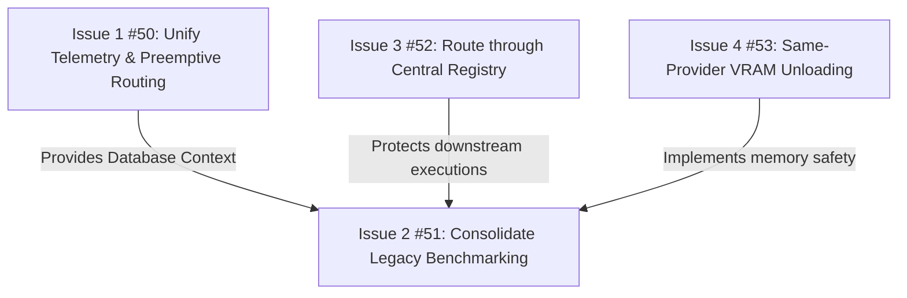

# Operational Issue Backlog & Governance Plan

This backlog transforms the findings from the technical audits (`docs/audits/Initial-Risk-Audit-5.20.26.md` and `docs/audits/Triage-Governance-Audit-5.20.26.md`) into a clean, operational backlog of active GitHub Issues.

---

## 1. Findings Analysis & Mapping Matrix

Each of the 10 findings has been evaluated to determine its current status, relation to existing issues, and required action type.

| Finding | Subsystem | Existing Issue? | Current Status | Action Taken / Issue | Type |
| :--- | :--- | :--- | :--- | :--- | :--- |
| **F-1: Routing Heuristic Bias** | `decision-engine` | No | **Still Valid** | Created Issue [#50](https://github.com/Heratiki/locallama-mcp/issues/50) | Bug / Architectural |
| **F-2: Legacy Benchmark Duplication** | `benchmark` | No | **Still Valid** | Created Issue [#51](https://github.com/Heratiki/locallama-mcp/issues/51) | Tech Debt / Drift |
| **F-3: SQLite vs. JSON Disconnect** | `benchmark`/`decision-engine` | Yes (Partially in Issue #49) | **Still Valid** | Grouped in Issue [#50](https://github.com/Heratiki/locallama-mcp/issues/50) (Relates to #49) | Bug / Architectural |
| **F-4: Complexity Capping** | `decision-engine` | No | **Still Valid** (Design Policy) | Documentation / ADR | Architecture policy |
| **F-5: Crude Code Heuristics** | `benchmark` | No | **Still Valid** | Roadmap / Future | Speculative |
| **F-6: Central Registry Bypass** | `decision-engine` | No | **Still Valid** | Created Issue [#52](https://github.com/Heratiki/locallama-mcp/issues/52) | Bug / Architectural |
| **F-7: Quality Misnomer** | `decision-engine` | No | **Still Valid** | No Action (Refactor in passing) | Low-value cleanup |
| **F-8: Missing Same-Provider VRAM Release** | `core` | No (Issue #27 only tested current behavior) | **Still Valid** | Created Issue [#53](https://github.com/Heratiki/locallama-mcp/issues/53) | Performance / Bug |
| **F-9: Stale Static JSON Metadata** | `core` | No | **Still Valid** | Roadmap / Future | Speculative |
| **F-10: Inactionable Rate Limit Swallowing** | `benchmark` | No | **Still Valid** | Grouped in Issue [#51](https://github.com/Heratiki/locallama-mcp/issues/51) | Error handling |

---

## 2. Active Operational Issues

The 6 active code findings have been grouped and submitted as **4 high-value, root-cause issues** on GitHub:

### Issue 1: [#50](https://github.com/Heratiki/locallama-mcp/issues/50) - Unify telemetry routing reads from SQLite-backed ModelRegistry and correct preemptive heuristic bias
*   **Labels**: `bug`, `ready-for-agent`
*   **Relates to**: Resolves the open **Issue #49** (`preemptive_route_task ignores low benchmark_model code scores`).
*   **Context**:
    `preemptive_route_task` loads model metrics from `models-db.json` via `getBestLocalModel`, whereas the modular `benchmark_model` tool writes to `benchmarks.db` and the in-memory `ModelRegistry`. This disconnect prevents empirical benchmark-derived capability corrections from influencing preemptive routing. Additionally, the scoring formula in `modelSelector.ts` weights telemetry history up to `1.1` but caps unbenchmarked heuristics at `0.4`, meaning small models with a single benchmark run permanently block larger, highly-capable models.
*   **Resolution Scope**:
    1. Update `modelSelector.ts` (`getBestLocalModel`) to query the SQLite-backed `ModelRegistry` or `CapabilityDetector` directly instead of loading from `modelsDbService` (`models-db.json`).
    2. Treat `models-db.json` only as a legacy/export cache for client compatibility, ensuring routing reads strictly from the unified SQLite database.
    3. Refactor heuristic scoring weights in `modelSelector.ts` so that unbenchmarked models are bootstrapped with a reasonable baseline score, preventing fast 2B/3B models from winning by default.

### Issue 2: [#51](https://github.com/Heratiki/locallama-mcp/issues/51) - Consolidate legacy benchmark service into modular engine and propagate rate-limiting errors
*   **Labels**: `ready-for-agent` (Maps to Technical Debt)
*   **Context**:
    The repository contains dual benchmarking architectures: the legacy `benchmarkService.ts` and the new modular `src/modules/benchmark/` engine. The `benchmark_free_models` tool still routes through the legacy path, bypassing modern provider interfaces and writing directly to `models-db.json`. Additionally, the legacy code silently swallows rate limits, returning empty success responses to the MCP client.
*   **Resolution Scope**:
    1. Port `benchmark_free_models` to the modular benchmarking engine in `src/modules/benchmark/`.
    2. Deprecate or remove legacy benchmark functions where safe, without breaking existing MCP tool compatibility.
    3. Implement structured error propagation. When a rate limit or API failure occurs during benchmarking, return a standard MCP error response with retry details back to the client instead of swallowing it.

### Issue 3: [#52](https://github.com/Heratiki/locallama-mcp/issues/52) - Route downstream code evaluation and task analysis through Provider Registry
*   **Labels**: `ready-for-agent` (Maps to Architectural Drift)
*   **Context**:
    Services like `codeEvaluationService`, `codeTaskAnalyzer`, `benchmarkService`, and `fallback-handler` bypass the central `ProviderRegistry` by importing `openRouterModule.callOpenRouterApi(...)` directly. This evades provider concurrency limits, request queuing, and circuit breakers, causing failures or hangs if OpenRouter is in an open/failed state.
*   **Resolution Scope**:
    1. Replace all direct calls to `openRouterModule.callOpenRouterApi(...)` with calls through the central `ProviderRegistry` or `TaskExecutor`.
    2. Ensure downstream tools obtain provider instances from the registry to invoke execution, thereby inheriting concurrency queues and circuit breakers.

### Issue 4: [#53](https://github.com/Heratiki/locallama-mcp/issues/53) - Implement same-provider model unloading validation and lifecycle hooks
*   **Labels**: `ready-for-agent` (Maps to Performance / Resource Management)
*   **Relates to**: Focuses on implementation/validation of same-provider model switches, building on test coverage in the closed **Issue #27**.
*   **Context**:
    The `localProviderLifecycle` unloads resources (calls `releaseResources`) only during cross-provider switches (e.g. Ollama to LM Studio). Switching models *within* the same provider (e.g., from `llama-3-8b` to `qwen-2.5-7b` on Ollama) does not trigger model unloading, leaving multiple large models resident in VRAM. This risks crashing the host on standard ≤16GB RAM hardware.
*   **Resolution Scope**:
    1. Update `localProviderLifecycle.beforeExecution` to detect when the active local model changes, even if it is on the same provider, and trigger `releaseResources` for the previously loaded model.
    2. Validate if sending `keep_alive: 0` or `keep_alive: "0s"` via Ollama's API works as a reliable unload mechanism.
    3. Investigate LM Studio API capabilities to find a supported model unload or release endpoint. If LM Studio (or any provider) does not support explicit unloading, report that limitation clearly instead of silently pretending release occurred.

---

## 3. Prioritization, Dependencies, and Blockers

### Prioritization & Dependencies Matrix

The issues should be implemented in the following sequence to align with dependencies and maximize early impact:

| Order | Issue / Task | Priority | Dependencies | Impact |
| :--- | :--- | :--- | :--- | :--- |
| 1 | **Issue 1 (#50)** (Telemetry Sync) | **Critical** | None (Resolves #49) | Aligns actual routing with empirical benchmark data. |
| 2 | **Issue 3 (#52)** (Registry Bypass) | **High** | None | Protects downstream task engines from network crashes. |
| 3 | **Issue 4 (#53)** (VRAM Unload) | **High** | None (Validates #27 findings) | Restores memory safety on 16GB developer machines. |
| 4 | **Issue 2 (#51)** (Benchmark Consolidation) | **Medium** | #50, #52, #53 | Eliminates duplicated code paths and silent errors. |

---

### Top 3 Operational Blockers

These three issues represent immediate threats to the correctness, stability, and integrity of the system:

1.  **Blocker 1: Telemetry-Routing Disconnect (Issue 1 / #50)**
    *   *Why*: It breaks the fundamental architectural truth: *"Benchmarks must materially influence routing behavior."* Currently, running benchmarks has **zero impact** on preemptive routing decisions.
2.  **Blocker 2: Concurrency & Circuit-Breaker Bypasses (Issue 3 / #52)**
    *   *Why*: Downstream model tasks directly query endpoints. If a paid provider experiences outages or reaches rate limits, the system fails to apply circuit breaker logic or queue requests, leading to hung processes.
3.  **Blocker 3: Same-Provider VRAM Bloat (Issue 4 / #53)**
    *   *Why*: When executing complex multi-model pipelines locally, Ollama/LM Studio keep all models loaded in memory, causing OOM failure on the standard developer laptops targeted by the PRD.

---

## 4. Findings Deferred (Intentionally NOT Issues)

The following findings should **not** become issues at this stage:

*   **F-4: Complexity Down-Routing (Capping)**
    *   *Why*: This is a product/policy constraint. Instead of a code bug, this requires updating `docs/PLAN.md` or a new ADR to specify what the system should do (e.g. log warnings, define strict fallbacks) when paid model access is disabled, rather than pretending the task is simple.
*   **F-5: Crude Code Heuristics**
    *   *Why*: Upgrading code validation to full AST compilers or unit execution is a major roadmap enhancement, not an operational bug. The current text-matching checks are sufficient as baseline telemetry.
*   **F-7: evaluateCodeQuality Misnomer**
    *   *Why*: While the function name is misleading, it represents low-value refactoring that does not impact server performance or routing. In alignment with project rules, we do not create issues for low-value cleanup.
*   **F-9: Stale Static JSON Metadata**
    *   *Why*: Replacing hardcoded static configuration with dynamic provider capabilities queries is a roadmap feature. The static database remains functional for core capabilities mapping.
