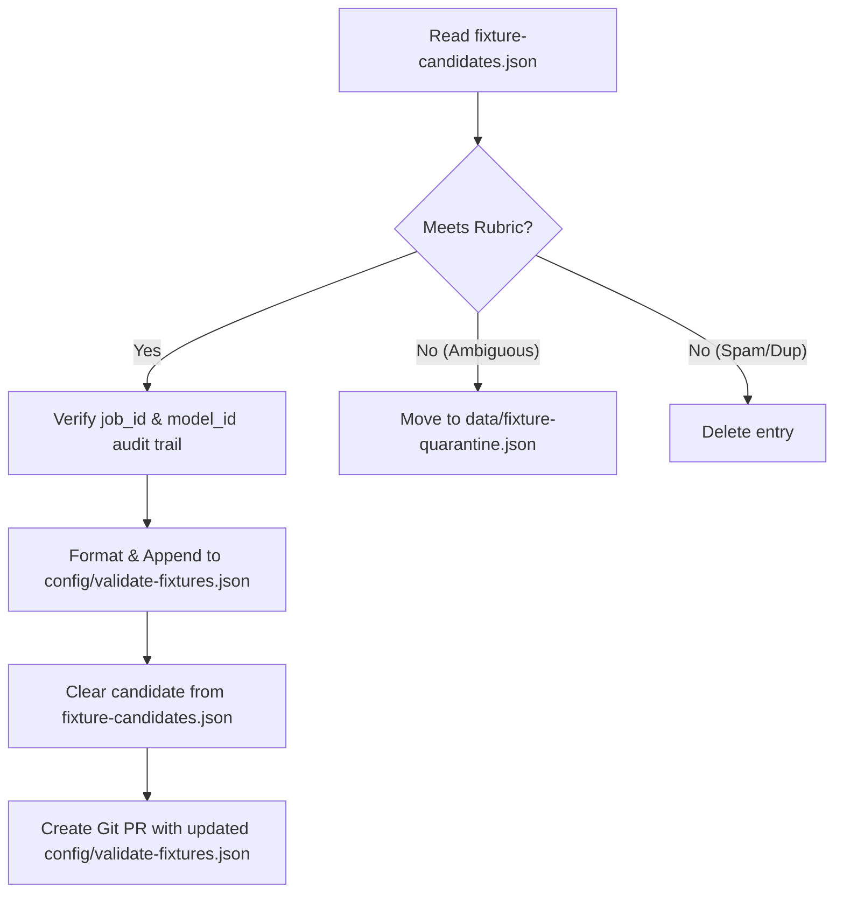

# Fixture Promotion Policy

This document defines the human review and promotion policy governing when fixture candidates move into the authoritative, version-controlled ground-truth set (`config/validate-fixtures.json`).

Negative feedback from users or automated rating tools on model validation outcomes writes candidate fixtures to `fixture-candidates.json`. These candidates reside in the temporary cache directory. To prevent bad labels or malformed data from polluting the benchmark truth, all promotions must go through the policy and rubric detailed below.

---

## 1. Reviewer Roles & Ownership

### System Operator
The **System Operator** is the sole owner of the authoritative ground-truth validation set. The System Operator is responsible for:
- Periodically reviewing the queue of candidates in `fixture-candidates.json`.
- Applying the acceptance rubric to each candidate.
- Verifying the provenance and audit metadata.
- Executing the promotion (via Pull Request), quarantine, or deletion paths.

---

## 2. Acceptance Rubric

A fixture candidate must satisfy all of the following criteria to be eligible for promotion to the authoritative validate benchmark set:

| Criterion | Requirement | Description |
|---|---|---|
| **Task Completeness & Clarity** | **Pass / Fail** | The task description (`task`) must be fully specified, clear, and self-contained. It should not contain environment-specific or ambiguous instructions. |
| **Output Label Verifiability** | **Pass / Fail** | The output must clearly and objectively match the label (`bad` or `good`). For a `bad` label, the failure (bug, incomplete implementation, incorrect evaluation) must be explicit and reproducible. |
| **Well-Formedness** | **Pass / Fail** | Code outputs must contain valid syntax for their respective language, except where the specific syntax/parsing failure itself is the subject of the benchmark. |
| **Value-Add / No Duplication** | **Pass / Fail** | The candidate must cover a unique failure mode, edge case, or pattern not already well-represented in `config/validate-fixtures.json`. Duplicate or near-identical tasks must be rejected. |

### Diagnostic Rubric Questions for the System Operator:
1. *Is the task definition unambiguous?* (If a model fails because the task was poorly described, the issue is the prompt, not the model. Do not promote.)
2. *Does the candidate output actually exhibit the claimed error?* (Verify the code. For example, in the Python `__main__` guard case, verify that `_main` was indeed output instead of `__main__`.)
3. *Is the correct/expected behavior obvious?* (A good benchmark fixture has a clear pass/fail distinction.)

---

## 3. Provenance & Audit Trail Requirements

To ensure that every promoted fixture can be traced back to its operational origin, the candidate must contain the following metadata in `fixture-candidates.json`:

- **`job_id`**: The unique identifier of the job that produced the output/failure.
- **`model_id`**: The identifier of the model (including provider prefix) that generated or evaluated the output.
- **`role`**: The role the model was performing (`generator` or `validator`).
- **`comment`**: Optional but highly recommended text explaining why the failure occurred (often supplied by the user/orchestrator during the `rate_model` call).
- **`timestamp`**: The Unix timestamp of when the rating was recorded.

Promoted fixtures in `config/validate-fixtures.json` must preserve these audit details in a metadata block or comments, ensuring future developers can trace the provenance of any test fixture.

---

## 4. Rejection & Quarantine Paths

Candidates that fail to meet the acceptance rubric must be handled via one of two paths:

### A. Quarantine Path
If a candidate has a high-value task but the output is ambiguous, or if it requires more investigation (e.g. intermittent compiler behavior, complex environment dependencies):
1. Move the candidate out of `fixture-candidates.json`.
2. Append it to `data/fixture-quarantine.json` (created locally in the cache/data directory).
3. Include an operator note describing what is needed to resolve the ambiguity.

### B. Deletion Path
If a candidate is malformed, duplicates an existing fixture, or is the result of spam/trivial user input:
1. Delete the candidate entry from `fixture-candidates.json`.
2. Do not persist it in any set.

---

## 5. Promotion Workflow

The System Operator executes the promotion workflow manually:

### Steps to Promote:
1. **Audit Check**: Extract the candidate from `fixture-candidates.json` and review its metadata.
2. **Local Validation**: Run/test the code output locally if necessary to verify the bug or behavior.
3. **Ground-Truth Insertion**:
   - Format the task and output into a validation fixture structure.
   - Append the fixture to `config/validate-fixtures.json`.
4. **Cache Cleansing**: Save the remaining candidates back to `fixture-candidates.json`, removing the promoted entry.
5. **PR Creation**: Commit `config/validate-fixtures.json` and open a Pull Request. Provide the `job_id` and model details in the PR description as the provenance audit trail.
